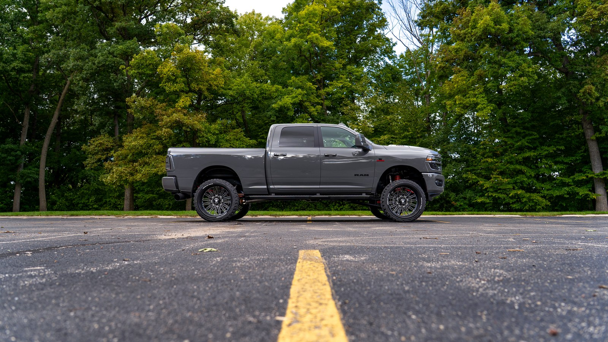

# Can You Build a Show Truck That Can Still Tow?
### 2026 Ram 3500 . Custom Offsets landing page

Three files, `index.html`, `styles.css` and `script.js`, plus an `images/` folder. No frameworks, no build
step, no third party scripts. The only network request is the Google Fonts stylesheet.

Open `index.html` in any browser.

---

## 1. Where the content came from

Everything on this page traces back to one source: the **"Can you build a show truck that can still
tow?" video brief**. No copy, data, or structure was carried over from the F-150 weekend build page
except the design system itself.

**What carried over from the F-150 page:** the color tokens, the four typefaces, the nav, hero, jump
band, parts carousel, FAQ accordion, blog grid, financing banner and modal, and the closing sections.
Same look, same components, same interaction patterns.

**What did not carry over:** every word about the truck. This page shares no build copy with the F-150.

**What the brief contains that this page deliberately leaves out:**

- The **description block** in the brief (timestamps for a cold air intake, tuner, lift kit, steps, and a tuner monitor, plus `#silverado #chevy` hashtags) describes a different build. None of those parts are on the Ram parts list, so none of them appear here.
- The **deliverables schedule** ("Cool Dads" daily driver, dad blogs, June content calendar) is production planning for other content.
- The **reference videos** are style examples, not this build.
- The **thumbnail options** and **voice over** notes are production direction.

---

## 2. The opening section: the meter

The brief's whole conceit is a slider that moves as each part goes on, ending somewhere between work
and show. That is now the first thing on the page.

**How it works.** One dial runs from **All work** on the left to **All show** on the right. Click any of
the nine parts and the white needle swings to that part's score, the detail card swaps, and the bar in
the verdict strip fills from dead center out to wherever the part landed, so you can see direction at a
glance. The **green diamond** on the arc holds the running average across all nine parts, which is the
answer to the video's question.

Each part card follows the brief's own stopping point structure, in the brief's order:

1. What it is
2. Why we chose it
3. Show or work
4. The other direction

**The math is data driven.** Scores live in the `PARTS` array at the top of the script. The average,
the readout wording, the needle angle, and the diamond position all recompute from that array, so
correcting a score fixes the dial, the number, and the verdict line together. Nothing is hardcoded.

### The scores, and which ones are real

| Part | Score | Where it came from |
|---|---|---|
| American Force 26x14 + Country Hunter MT II | **78** | The brief: "more of a show, it is almost too wide" |
| Kryptonite Death Grip steering group | 12 | Proposed |
| Banks RAM Air differential cover | 30 | Proposed |
| R1 Concepts rotors | 35 | Proposed |
| AgriCover Lomax tonneau | 35 | Proposed |
| Boost Auto mirror and cab lights | 55 | Proposed |
| Magnaflow Black DPF Series | 60 | Proposed |
| Banks billet diesel and DEF caps | 90 | Proposed |
| Adrenaline UFO Glow bundle | 95 | Proposed |
| **Build average** | **54** | Computed |

**Only the wheels are the build's own call.** The brief rates that one part and no others. The other
eight are my proposals, placed so the component is usable and so you have something concrete to argue
with. Every proposed part carries visible `TK_CALL`, `TK_WHY`, and `TK_OTHER` markers in its card.

At 54 the build currently reads "Right in the middle, which was the goal." That is a coincidence of my
proposals, not a finding. Expect it to move once the real calls come in.

---

## 3. Sections on this page

Per your direction, the F-150 sections that do not apply were dropped: **no quick shot spec bar, no
tool checklist, no stats bar.**

| Section | Status |
|---|---|
| Hero | Written from the brief's intro |
| Show or work meter | Built, one real score |
| Buy now, pay later | House financing copy, sits directly under the meter |
| Full parts list | All 13 items, 9 category tabs |
| Watch it now | Embed placeholder, needs the video ID |
| The build story | Intro written from the brief, four sections TK |
| FAQ | 6 questions, 3 answered from the brief, 3 TK |
| Blogs | 3 placeholder cards |
| Start your build | Written |
| Footer | Written |

---

## 4. The parts list

Thirteen cards across the brief's own nine groups: Wheels & Tires, Brakes, Drivetrain, Engine Bay,
Lighting, Steering, Exhaust, Bed, plus All Parts. Six cards per page with the same arrow and dot
pagination as the F-150 page.

**Product links.** Five items ship with the manufacturer URLs given in the brief: R1 Concepts, both
Banks kits, Adrenaline Offroad, and AgriCover. The other eight have no URL in the brief, so their View
Product button points at the matching Custom Offsets category and the card carries a `TK_LINK` marker.

**Every price is `$TK` and every SKU is `TK_SKU`.** The brief has no pricing.

---

## 5. What I need from you

Roughly in order of how much they block the page:

1. **Wheel size.** The parts list says American Force **26x14** with a 35x14.50R26LT tire. The install segment says "these are **22x14s**." I went with 26x14, since the tire size is a 26in tire and two data points beat one. If it is really 22s, the tire size in the brief needs correcting too.
2. **The eight remaining show or work calls**, ideally as a number out of 100 or just a verdict sentence I can place. This is the page's whole first section.
3. **The maximum width on a 4in lift.** The brief leaves it as a bracket: "this truck can run [X]." It appears twice, in the meter and in the FAQ, as `TK_MAX_WIDTH`.
4. **Prices and SKUs** for all 13 parts, plus Custom Offsets product URLs for the eight without links.
5. **The YouTube video ID** once it is live.
6. **Build story copy** for four sections: the wheels on the road, the work parts, the show parts, and where it landed.
7. **Three FAQ answers:** which parts to avoid on a working truck, where the build landed, and which groups carry to other heavy duty trucks.
8. **Three blog cards** and a publish date for the byline.
9. **Real photography.** Every image in the zip is a labeled placeholder that names the shot it wants.

---

## 6. Financing copy

The banner and modal use standard Custom Offsets financing language, matched to the F-150 page: Affirm
as low as 0% APR, Katapult as low as $1 down. The brief has nothing about financing, so if the terms
have changed since the F-150 page shipped, this copy needs the same correction.

Both Affirm and Katapult logos are still placeholders, same as on the F-150 page. The real assets are
at `affirm.com/brand` and Katapult's brand kit.

---

## 7. Images

28 placeholders, each labeled on the image with its filename, dimensions, aspect ratio, and the shot it
is standing in for.

| Group | Files |
|---|---|
| Hero | `hero-ram.jpg`, 2200x1250 |
| Meter | `meter-wheels` through `meter-tonneau`, nine at 1600x900 |
| Products | `part-*.jpg`, thirteen at 1200x900 |
| Blogs | `blog-01` to `blog-03`, 1000x625 |
| Other | `video-poster.jpg`, `og-share.jpg` |

`logo.png`, `affirm-logo.svg`, and `katapult-logo.svg` carried over from the F-150 build.

The hero note is worth repeating: leave headroom above the cab and keep the left third clear, because
the headline sits there.

---

## 8. Verification

Rendered in headless Chromium with the real typefaces inlined.

```
viewports    1440x900 . 820x1180 . 390x844
overflow     none at any width
meter        9 parts, needle and diamond track the data, average computes to 54
parts tabs   all 13 . wheels and tires 2 . brakes 1 . drivetrain 1 . engine bay 1
             lighting 3 . steering 3 . exhaust 1 . bed 1
carousel     6 per page, pager appears only when a filter has more than one page
modal        opens, traps focus, closes on Escape and on the scrim
assets       no failed image requests
console      no errors
em dashes    0
```

---

## 9. Round 2: the real gauge art, one box

### Your assets are now the gauge

`Main_.png` and `SLider_.png` are in as `images/gauge-bar.png` and `images/gauge-pointer.png`. Both were
cropped to their artwork and kept on transparent backgrounds, and the bar was resized to 1400px wide,
which is more than twice its largest rendered size.

The SVG dial is gone. The chrome pointer now rides the bar, sliding to the selected part with the same
easing the old needle used.

**The orientation flipped, which matters.** Your art runs **show truck on the left, work truck on the
right**, the reverse of the dial I built. So a part that scores high on show now sits toward the left,
near Losing Capability, and the Kryptonite steering group sits far right at Full Capability. The scores
in the `PARTS` array did not change, only how they map to the track.

The pointer's travel is clamped to the lit part of the track, not the whole image. Those two numbers
live at the top of the gauge code:

```js
var TRACK_L = 7.9, TRACK_R = 92.1;   // measured off the artwork
function posFor(score){ return TRACK_L + ((100 - score) / 100) * (TRACK_R - TRACK_L); }
```

If the art ever gets re-cropped, those are the only two numbers to re-measure.

Positions as they stand: UFO glow 12.1% from the left, wheels 26.4%, build average 46.6%, steering
82.0%.

### One box, one width

The two columns are merged into a single panel: gauge across the top, the build average line under it,
the part chips, then the part detail as an image and text pair inside the same box. The panel is the
same element width as the financing banner below it, verified at 1184px wide with a matching left edge
at 1440, and matching at 820 and 390 as well.

### The horizontal meter is gone

The `ALL WORK 12/100` strip with the progress bar came out. The verdict and score now sit in a compact
chip next to the part name, since the gauge already shows position and the bar was saying it twice.

The build average kept a marker, but a small one: a green caret on a rail directly under the bar, with
the number spelled out in the line beneath it.

### Verification

```
viewports     1440x1000 . 820x1180 . 390x844
panel width   matches the financing banner exactly at all three
overflow      none
pointer       tracks the data, 12.1% to 82.0% across the nine parts
console       no errors
em dashes     0
```

---

## 10. Round 3: the photo bucket, the lean readout, the marker

### The part photo fills its column

The detail image was locked to 16:9 and the text column next to it runs taller, so the bottom of that
column sat empty. The image box now stretches to whatever height the text needs, with the photo filling
it. Below 900px the box goes back to 16:9, since a tall crop on a phone is worse than a short one.

Placeholder art looks badly cropped in that tall box because it is a wide label card. Real 16:9
photography will crop from the top and bottom, which is the normal behavior.

### No more scores on screen

The `78 /100` chip is gone. In its place is a five segment lean scale, running show side on the left to
work side on the right so it reads the same direction as the gauge, with one segment lit and a plain
verdict under it:

| Score | Segment lit | Reads |
|---|---|---|
| 82 and up | far left | All show |
| 60 to 81 | left | Leans show |
| 41 to 59 | center, lit green | Right down the middle |
| 19 to 40 | right | Leans work |
| 18 and under | far right | All work |

The middle segment lights green rather than red, so landing in the middle looks like the win the video
says it is.

**Scores still exist, they just never print.** They drive the pointer, the lean scale, and the average.
Nothing on the page grades a part out of 100 any more.

The headline moved the same direction. It read "Build sits at 54 of 100" and now reads **"The build
landed a hair show of center."** The phrase is picked from how far the average sits off 50:

- 3 or less: dead center
- 4 to 9: a hair show or work of center
- 10 to 20: on the show or work side
- more than 20: well onto the show or work side

The line under it changes with it, from "that is the target hit" down to "something on this list has to
earn its keep."

### The average marker is much louder

The small caret under the bar became a marker on the artwork itself: a 7px green bar spanning the
track, with a dark outline so it reads against both the red and the grey, a wide glow, and a caret
pointing down into it from above. Under the bar the label is now a solid green pill reading **Where the
build landed**, with a matching caret.

### Verification

```
viewports     1440x1000 . 820x1180 . 390x844
panel width   still matches the financing banner at all three
lean scale    all nine parts light the correct segment
copy          zero instances of "/100" anywhere in the file
console       no errors
em dashes     0
```

---

## 11. Round 4: full copy pass, BDS parts, Custom Offsets links

Source: the "Ram 3500 Show vs Work: Full Page Copy" doc dated Sep 22. Every line on the page now
matches it, plus the two part changes and a full link pass.

### Parts changes

**Added: BDS Suspension 4-inch Lift Kit.** New card, new **Lift Kit** category tab between Wheels &
Tires and Brakes, and a new meter card, which makes the meter ten parts instead of nine. Copy from the
doc: "A 4 inch lift complete with radius arms and dual rate coil springs. Perfect for stance and
drivability."

**Replaced: the Kryptonite track bar is out, the BDS front adjustable track bar is in.** "A forged,
front adjustable track bar which allows you to re-center the axle." The Kryptonite Death Grip steering
kit and the Fox 2.0 dual stabilizer both stay, per the doc, and both got the doc's new detail copy.
The meter's steering card no longer mentions a track bar.

**The lift kit's meter score is a proposal: 55,** a touch show of center, reasoning that the lift is
what makes the 26x14s fit while the radius arms and dual rate springs give back some of what a lift
usually costs. Marked TK like the other eight. The build average moved from 54 to 55, so the headline
still reads "a hair show of center."

### Copy updated to the doc

Meta description and OG description, hero subhead, meter headline and lede, the financing banner, the
whole financing modal including the new long fine print with the affirm.com/lenders link, thirteen
parts list descriptions, four meter card fields, the story's wheels header, three FAQ answers, the
video lede, and the closing button.

The word **dial is gone**, replaced by **meter** everywhere it appeared: two meta tags, the meter lede,
the video lede, the story, two FAQ answers, the closing button, and the code comments.

The FAQ answer on tire width is now the doc's shorter version, which drops the `TK_MAX_WIDTH`
placeholder from that answer. It still appears once, in the wheels meter card, where the doc keeps it.

### Product links

Every View Product and Shop button on the page now points at customwheeloffset.com. Zero off site
links, where before three cards pointed at R1 Concepts, Banks, Adrenaline, and AgriCover directly.

**Exact product pages found:**

| Part | Page |
|---|---|
| Fury Country Hunter MT II 35x14.50R26LT | `/buy-wheel-offset2/FCHIIF35145026/...` |
| Boost Auto mirror lights | `/store/lighting/155914/...led-switchback-clear-lens-19-22-ram-2500-3500` |
| Kryptonite Death Grip steering kit | `/store/suspension/120364/...14-22-ram-2500-3500-4wd` |

**Closest listing used, because no exact page turned up:**

| Part | Page | Why |
|---|---|---|
| American Force 26x14 | `/brands/wheels/American+Force/26x14` | The doc never names the wheel model |
| BDS 4-inch lift kit | `/brands/suspension/BDS+Suspension` | Closest listed kit is BDS1660H, 19-24 Ram 2500 diesel |
| BDS front adjustable track bar | `/brands/suspension/BDS+Suspension` | Only the Ford F-250/350 bar is listed |
| R1 Concepts rotors | `/store/brakes` | R1 Concepts does not appear to be carried |
| Banks RAM Air diff cover | `/store/performance/driveline/diff-covers` | Only the older natural aluminum AAM cover is listed |
| Banks billet caps | `/brands/engine/Banks+Power` | Cap kit not listed |
| Boost Auto cab lights | `/brands/exterior-lighting/Boost+Auto` | Only the 10-18 Ram cab lights are listed |
| Adrenaline UFO Glow bundle | `/store/lighting/auxiliary-lighting?brand=Adrenaline+Offroad` | Bundle not listed, the brand's wheel lights are |
| Magnaflow Black DPF Series | `/brands/exhaust/MagnaFlow` | MAG-17069 is the same 5in black DPF back, listed for 07-18 |
| AgriCover Lomax | `/store/exterior-accessories` | LOMAX is carried, but not for a 19+ Ram bed |

**Two things worth knowing about fitment.** The Kryptonite steering kit page lists 14-24 Ram 2500/3500
and the Boost mirror lights list 19-22, so neither states 2026 coverage. The links go to the right
product on the right platform, but somebody should confirm the year before launch. Custom Offsets pages
return nothing to a fetch from this session, so none of these could be status checked from here.

### Verification

```
viewports     1440x1000 . 820x1180 . 390x844, no overflow at any width
panel width   still matches the financing banner
meter         10 parts, badge reads "Part 01 of 10", average 55, headline "a hair show of center"
parts tabs    all 14 . wheels and tires 2 . lift kit 1 . brakes 1 . drivetrain 1 . engine bay 1
              lighting 3 . steering 3 . exhaust 1 . bed 1
links         14 of 14 View Product buttons on customwheeloffset.com, 0 off site
console       no errors
em dashes     0
```

---

## 12. Round 5: new meter artwork, legend removed, links tightened

### The slider art was replaced

`images/gauge-bar.png` is now the version without the Losing Capability and Full Capability plates. The
file is 2489x543 where the old one was 2489x661, so the pointer and the green marker were re-seated
against the new geometry:

| | Old art | New art |
|---|---|---|
| Lit track, horizontal | 7.9% to 92.1% | 7.9% to 92.0%, unchanged |
| Lit track, vertical | centred near 47% | 25% to 48.8%, centred at 36.9% |
| Pointer | `top:47%`, `width:7.6%` | `top:36.9%`, `width:6.4%` |
| Green marker | `top:29%`, `height:38%` | `top:22.5%`, `height:29%` |

The track's horizontal inset is identical, so `TRACK_L` and `TRACK_R` in the script did not change and
every pointer position is the same as before.

### The legend line is gone

"Green marks the build" came out. The green marker on the bar and the green **Where the build landed**
pill under it already say it twice, and you were reading it a third time.

### Three links got more specific

| Part | Now points at |
|---|---|
| BDS 4-inch lift kit | `/store/suspension/145625/...19-23-ram-3500-4wd-diesel`, the 4in radius arm kit for a Ram 3500 |
| Magnaflow Black DPF Series | `/store/performance/77487/...5-single-side-rear-exit-dpf-back-exhaust-black-tip`, MAG-17069 |
| AgriCover Lomax | `/store/accessories/Bed-Covers` |

Both of those product pages list older year ranges, 19-23 for the BDS kit and 07-18 for the Magnaflow,
so they are the right product on the right platform but not a confirmed 2026 fitment.

### Prices are still open

Every card still reads `$TK`. Custom Offsets product pages return a 405 to any fetch from this session,
so no price on that site is readable from here, and inventing one or pulling a manufacturer MSRP would
put a wrong number in front of a customer. The prices have to come from your side, as a list of the 14
parts with what Custom Offsets sells each for.

Five links are also still pointed at a category or brand page rather than an exact product, because no
matching product page turned up: the American Force wheel, which the copy never names by model, the
R1 Concepts rotors, the Banks cap kit, the Boost cab lights, the Adrenaline UFO bundle, the BDS track
bar, and the Kryptonite dual stabilizer.

---

## 13. Round 6: real photography in twelve slots

Six source files came in: five JPGs and one Sony raw, `Wheel Lights.ARW`, which was developed with
rawpy at camera white balance and rendered to 9568x6376 before cropping.

Each one was cropped to the slot's aspect and saved at the size that slot calls for, rather than
dropped in at full resolution.

| Source | Now lives at | Size |
|---|---|---|
| Towing the gooseneck | `hero-ram.jpg` | 2160x1215 |
| Towing the gooseneck | `og-share.jpg` | 1200x630 |
| Side profile, truck on the 26x14s | `video-poster.jpg` | 1600x900 |
| Wheel and tire, front three quarter low | `meter-wheels.jpg` | 1600x900 |
| Wheel and tire | `part-wheels.jpg` | 1200x900 |
| Wheel and tire, zoomed on the tread and sidewall | `part-tires.jpg` | 1200x900 |
| BDS radius arm underside | `meter-lift.jpg` | 1600x900 |
| BDS radius arm underside | `part-liftkit.jpg` | 1200x900 |
| Banks diff cover underside | `meter-diff.jpg` | 1600x900 |
| Banks diff cover underside | `part-diffcover.jpg` | 1200x900 |
| Wheel ring lights, from the raw | `meter-ufo.jpg` | 1600x900 |
| Wheel ring lights, from the raw | `part-ufoglow.jpg` | 1200x900 |

The tire card is a tighter crop of the same frame as the wheel card, pulled left onto the tread blocks
and the lettering so the two cards do not read as the same photo twice.

Alt text was rewritten on the two that changed subject: the hero is now a profile shot rather than a
towing shot, and the video poster is the towing frame.

### Two things to look at

**The hero is the towing shot,** which is the right call for a headline that asks whether it can still
tow. I had first read that frame as a different truck and led with the side profile instead; it is the
same build in motion, so the two swapped back.

**That frame is the low resolution one of the six.** The source is 2160x1250, so the hero is written at
2160x1215 rather than upscaled to a number it cannot support. It is sharp up to about a 2100px wide
browser window and softens past that on a 4K display. If a larger export of that frame exists, it is the
single highest value image upgrade on the page.

**Still on placeholders:** the brakes, engine bay, both Boost lighting cards, steering, exhaust, bed,
the three blog thumbnails, and the meter cards for brakes, caps, Boost lighting, steering, exhaust and
tonneau.

---

## 14. Round 7: the hero shows the whole rig

The towing frame is 2160x1250, and the hero box is wider than that at every desktop size, so cover was
cropping into the rig: the trailer ran off the left edge and the truck's nose off the right.

Rather than crop tighter, the photo was **placed inside a wider master**. `hero-ram.jpg` is now
3200x1350 with the original frame sitting at 62% of the width and 85% of the height, centered. The
surround is the same photo blown up, blurred, and darkened, with the seams feathered, so it reads as
motion blur rather than a letterbox bar.

| Window | Box | What shows |
|---|---|---|
| 1440 laptop | 1440x760 | Full rig, margin on both sides |
| 2560 ultrawide | 2560x760 | Full rig, some sky and road trimmed |
| 390 phone | 390x760 | Center slice, lands on the cab and grille |

### If you want a real wide export instead

The padding is a workaround for a frame that is not wide enough. A native export beats it. The spec:

```
Master        3200 x 1350 px (2.37:1), JPG, sRGB, quality 85 or better
Safe area     central 2560 x 945 px, which is 80% of width by 70% of height
              everything that must never be cropped lives inside it
Subject       truck right of center, trailer trailing left, same as this frame
Headline zone left 45% of the frame, top to about two thirds down, stays quiet
              a dark gradient already sits over it, so background detail there is fine
Phone         only the central 22% of width survives on a 390px screen, so keep the
              cab and grille near horizontal center
```

The safe area is what it is because a 1440 laptop crops the sides to 80% of the width while an
ultrawide crops the height to 70%. The intersection of those two is the region that always survives.

**A portrait crop would be better than relying on the center slice.** Export a second file at
1200x1600 with the truck filling it, and the page can serve that below 700px wide. That is a ten line
change once the file exists.

---

## 15. Round 8: Engine Bay removed from the meter

The Banks billet cap card is out of the show vs work meter. The meter goes from ten parts to nine.

**Removed:** the `id:"caps"` entry from the `PARTS` array. Nothing else in that section changed, and
the code reads `PARTS.length` everywhere, so the badge, the chip row, and the "averaged across all N
parts" line all picked up the new count on their own.

**What stayed:** the Engine Bay card in the full parts list, and the Engine Bay tab above it. The
request was scoped to the meter, so the Banks caps still sell in the parts section.

### It moved the average

Dropping a 90 out of a nine-part set pulls the mean down.

| | Before | After |
|---|---|---|
| Parts in the meter | 10 | 9 |
| Average | 55 | 51 |
| Headline | The build landed **a hair show of center**. | The build landed **dead center**. |
| Note | Close enough to the middle to call it: still a work truck, just not a boring one. | That is the target hit, a truck that shows up and still works. |

That is the copy doing its job, not a bug. The caps were the second most show leaning part on the
list, behind only the UFO bundle, so taking them out moved the green marker about four points toward
work and tripped the "dead center" threshold, which is anything within three points of 50.

### Verified

- Meter section fits at 1440, 820, and 390, and still matches the financing banner width exactly
- Badge reads "Part 01 of 09" through "Part 09 of 09"
- Nine chips, no wrap, no console errors
- All 14 parts cards and all 10 parts tabs intact, every link still on customwheeloffset.com

`images/meter-caps.jpg` is now unreferenced. It is still in the folder in case the card comes back.

---

## 16. Round 9: copy filled from a visual pass of the cut

The rough cut on Frame.io is **FULL_R.C#2.mov, 35:20 long**. It has **no transcript and no caption track**,
and speech to text is not available in this environment, so none of the narration could be read. What
follows was written from **52 sampled frames** across the full runtime plus the product facts already
established in the brief. Everything sourced from an actual frame is listed below. Everything else is a
proposal in Custom Offsets voice and needs a pass from whoever was on camera.

### What the frames actually show

| Time | What is on screen |
|---|---|
| 0:08 | Vertical phone footage of a severe storm, captioned **APPLETON, Wis.** |
| 0:20 | "COMING UP" over the finished truck at an outdoor show on grass |
| 0:32 | Drone shot, the truck towing an enclosed cargo trailer on a snow covered road |
| 0:50 | Hitched to a black **Ranch King** gooseneck |
| 1:10 | A **cars.com listing for a New 2026 RAM 3500 Limited**, Burlington WI dealer, over a text thread: "We need a new truck to pull the trailer." / "Finally...Anything?" / "sure" / "dually?" / "No." / "boomer..." / "I'm getting a dually" / "We'll just keep the F-250 then" |
| 3:10 | A bare black radius arm on the bench with its instructions |
| 4:50 | **KRYPTONITE** lower third, boxes open on the floor |
| 5:30 | Powder coat booth, orange powder going onto a long suspension bar |
| 6:10 | Phone footage of tornado damage, shot from inside a truck |
| 6:50 – 8:10 | Parts staged on blue tables: powder coated arms, track bar, bump stops, tie rods |
| 7:30 | At the tow mirror |
| 8:50 | Working on the cab roof |
| 10:10 – 11:30 | Front clip off, suspension stripped, truck on stands |
| 12:50, 13:30 | **Red radius arm installed** at the front axle |
| 14:10 | The finned **BANKS** differential cover held up to camera |
| 14:50, 16:10 | Gear oil drained, cover bolted on |
| 15:30 | Fuel and DEF filler door, the blue factory DEF cap |
| 17:49 | Measuring ride height under the front with a yardstick |
| 18:10 – 19:10 | **Transfer case down, indexing ring visible** |
| 20:39 | **ADRENALINE OFFROAD "ULTRALUX ROCK LIGHTS"** box |
| 21:20, 21:59 | Wheel ring light unboxed, **WHEEL LIGHTS** and **ROCK LIGHTS** install guides on camera |
| 23:20, 23:59 | Under the truck on a creeper running light wiring |
| 24:39, 25:20 | MagnaFlow black tip and piping laid out |
| 25:59 | Banks cover and black exhaust both installed |
| 26:40 | Red coils and red radius arms in, front end back together |
| 27:59, 28:40 | **Air springs with red brackets**, staged then installed on the rear |
| 30:00 | **AMERICAN FORCE** lower third, 26x14 mounted on a Fury Country Hunter MT II |
| 32:00 | Finished truck in the shop, blue glow under the frame |
| 32:39 – 33:59 | Hitched to the gooseneck on grass at the show |
| 34:32 | Whiteboard: **"THIS TRUCK WAS BUILT TO BE THE PERFECT MIX OF WORK / SHOW — DID WE GET IT?"** Tally marks run heavily **YES**, with **2 NOPE**. Footnote: "This is our next YouTube video!" |
| 35:18 | End card, CUSTOM OFFSETS / STOCK TRUCKS SUCK |

### Three things the cut changes about this page

**1. There is an air spring kit on this truck that is not on this page.** At 27:59 and 28:40, a pair of
double convoluted air springs on red brackets go onto the rear. Nothing in either copy doc mentions them
and there is no parts card for them. On a truck whose whole argument is "still tows," rear air springs are
one of the strongest work side parts in the build. They should probably be a tenth meter part and a
fifteenth parts card. Brand not confirmed from the frames.

**2. The cold open is the story, and the story is not in the copy doc.** Appleton storm footage at 0:08,
tornado damage at 6:10, the truck towing through snow at 0:32, and the cars.com listing with the dually
argument at 1:10. That is a real opening for the build story and right now the page opens on "it is just
kind of boring." Worth a decision.

**3. The whiteboard is the page's thesis, on camera.** "Did we get it?" answered overwhelmingly yes. That
is the same claim the meter now makes on its own, which is a good sign. The exact tally is not legible
enough to quote a number.

### What got filled

- **Nine meter cards**, every `why` / `call` / `other` row. Verdict wording still opens with "Proposed at,"
  because the scores themselves have not been confirmed on camera.
- **Four build story sections**: the wheels follow up, the parts that earn their keep, the parts that are
  just for you, and where it landed. Story is now 888 words, byline reads 4 Min Read.
- **Four FAQ answers**: Q1 close, Q4 what to avoid, Q5 where it landed, Q6 whether the list is Ram only.
- **Twelve parts card blurbs.** Every `TK_COPY` is gone.

### What is still open

- **Not seen anywhere in the cut:** the brake rotor install and the tonneau install. Both cards are written
  from the product, not from footage.
- **Claims that needed a measurement were cut rather than invented.** No gear oil temps, no decibels, no
  "how it held up in weather." If those numbers were said on camera, they can go back in.
- Still `TK`: `TK_MAX_WIDTH`, all 14 prices and SKUs, `TK_DATE`, `TK_VIDEO_ID`, the two lender logos, and
  the three blog cards.

### Verified

Meter fits at 1440x900, 1440x1000 and 390x844 with every one of the nine parts selected, no text clipped in
any detail row, no horizontal overflow, panel still matches the financing banner width, no console errors,
all 14 parts links still on customwheeloffset.com. The longer copy grew the tallest meter box from 1242px
to 1267px.

---

## 17. Round 10: scoring language out, full copy consistency pass

### The ask

Remove the numbers and the "proposed" hedging from the Show or work rows, then read the whole page for
copy that does not agree with itself.

### Scoring language, gone

The eight verdict rows opened with "Proposed at 55," "Proposed at 30," and so on. Two problems: it put
internal review language on a customer page, and it reintroduced the 0 to 100 scale that was deliberately
pulled out of the UI back in round 3.

Rewritten so each row gives the reason for the placement instead of restating a number. It also no longer
repeats the lean label, which the chip directly above it already prints.

| | Before | After |
|---|---|---|
| Diff cover | Proposed at 30, work leaning. Cooler gear oil under a trailer is real work. | Cooler gear oil under a trailer is real work. That it happens to look like a machined part is the bonus. |
| Glow kit | Proposed at 95, all show, which is the whole point of it. | Nothing about this truck works better with it on, which is the whole point of it. |
| Steering | Proposed at 12, nearly all work. Once the wheels are on you cannot see a single piece of it. | Once the wheels are on you cannot see a single piece of it. All of the value is in how the truck drives with a trailer behind it. |

Which calls are confirmed and which are not is tracked here in the README now, not on the page.

### The rest of the 0 to 100 scale, also gone

- The running average line ended "and every call except the wheels is still a proposal." Cut.
- FAQ 1 read "Land at 50 and you have a truck that..." Now "Land in the middle."
- Story close and FAQ 5 both said the build landed "within a point of the middle," which implies the same
  hidden scale. Both rewritten.

### Repetition found and fixed

- **The gooseneck-and-grass line** closed the story and also closed FAQ 1, near word for word. FAQ 1 now
  ends on the point instead of the image.
- **"We build one of these every year and always drift show"** appeared three times: in the doc-sourced
  story intro, in the story close, and in FAQ 5. Cut from FAQ 5.
- **The differential cover parts card** said gear oil runs cooler twice and mentioned the fluid volume
  twice, because the round 9 addition duplicated the doc's original sentence. Merged into one paragraph.
- **"and that is what places it"** landed on two adjacent meter cards, and **"tips it toward"** on two more.
  Both varied.

### Wording and style

- `scored it that way` in the story is now `called it that way`, which matches the rule the page states
  twice: every part gets **called** a show mod, a work mod, or both.
- Inch style unified on the `4in` form, which already outnumbered `4 inch` eighteen to six. Product names
  keep their own styling, so the card heading is still "4-inch Lift Kit."
- The Kryptonite steering kit card said "this is the group," but the group is two cards. Now "this is the kit."
- The glow kit's "we are not going to invent one" was a writer talking about writing. Rewritten to be about
  the truck.
- Brand styling corrected to the manufacturers' own: **MagnaFlow** (was Magnaflow) and **Agri-Cover** (was
  AgriCover), three instances each. **Revert these if the Custom Offsets catalog spells them differently,**
  since matching the catalog matters more than matching the manufacturer.
- The no-JS fallback text under the gauge said "near the middle" while the live readout says "dead center."
  Aligned.

### Flagged, not changed, because it is your copy

**The page is written in two tenses.** The hero and the meter intro came from the copy doc and speak as if
the build is still happening:

> "So we're building one that holds its own at any show..."
> "at the end we find out where the build actually landed"
> "The green marker is the running average, which is the whole point: we are trying to land right in the middle."

The meter, the story and the FAQ all now speak from finished, past tense, and the gauge announces "The build
landed dead center" a few hundred pixels below a line promising we will find out at the end. Either the hero
stays a teaser and that is intentional, or those three passages want a past tense pass. Your call.

**Contractions.** The hero uses "it's" and "we're," and the financing block uses "won't." The other roughly
3,000 words of the page use none. Both doc-sourced, so left alone.

### Verified

No em dashes anywhere. Every remaining `TK` is a data placeholder, not copy: 14 SKUs, 14 prices, 12 product
links, the publish date, the video ID, the two lender logos, the three blog cards and `TK_MAX_WIDTH`. Meter
fits at 1440x900, 1440x1000 and 390x844 with all nine parts selected, no clipped rows, no horizontal
overflow, still matches the financing banner width, no console errors, all 14 parts links on
customwheeloffset.com.

---

## 18. Round 11: the side profile moves to the closing section

The full side profile that was sitting in the video placeholder is now the closing shot, full bleed,
between the "Start your build" copy and the footer.

**File renamed.** `images/video-poster.jpg` is now `images/cta-ram.jpg`. Nothing else referenced it.

**New markup**, a sibling of `.next__in` rather than a child, so it escapes `.wrap` and runs edge to edge:

```html
<div class="closer rv">
  
</div>
```

**New CSS.** `.next` loses its bottom padding so the band sits flush on the footer. The band is
`height: clamp(250px, 26vw, 620px)`, so the crop aspect stays sane instead of going letterbox on an
ultrawide. A single gradient does two jobs: solid ink at the top so the band emerges out of the CTA
background with no seam, and a hard fade at the bottom into the footer's panel color.

Below 640px the band goes to a fixed 330px. On a phone the cover crop works on width instead of height, so
a taller band crops in tighter and the truck actually reads instead of sitting tiny in the middle of a wide
frame.

| Viewport | Band | What shows |
|---|---|---|
| 390 phone | 390x330 | Truck fills most of the frame, yellow line leading in |
| 1440 laptop | 1440x374 | Whole truck, trees behind, asphalt strip below |
| 2560 ultrawide | 2560x620 | Whole truck large, full tree line |

### The video placeholder is now empty on purpose

The poster photo is gone and the slot is a plain black 16:9 panel with the play mark, "YouTube embed goes
here" and the `TK_VIDEO_ID` pill. That is deliberate. **Once the real embed goes in, the poster is thrown
away anyway** because YouTube serves its own thumbnail, so a hero grade photo sitting there was doing no
production work. The empty panel now reads the same way every other TK slot on the page reads.

### Worth knowing about the file

`cta-ram.jpg` is 1600x900. At the 1440 band the browser uses it nearly one to one, so it is sharp. On a
2560 display the visible strip gets upscaled about 1.6x. It holds up because the top of it sits under a
gradient, but a **2560x1440 re-export of the same frame** would sharpen the bottom half where the truck
and the asphalt are. Not urgent.

### Verified

No horizontal overflow at 1440, 820 or 390. Meter still matches the financing banner width. No failed
assets, no console errors. All 14 parts links still on customwheeloffset.com.

---

## 19. Round 12: new hero frame, edges feathered instead of cropped

The supplied frame is **4000x1250** of the rig on the highway, which is the wide native export the round 7
notes asked for. The blurred-surround workaround from round 7 is gone.

### The master

`images/hero-ram.jpg` is now **4000x1560** (2.56:1). That is the 4000x1250 photo sitting in a slightly
taller canvas, with 155px of headroom above and below. The padding exists only so the hero never ends on a
hard edge:

- The photo's outermost six rows are stretched into the bands, so the sky and the road keep running rather
  than meeting a flat color on a line
- An eased alpha ramp fades those bands to `--ink`, and the ramp **starts 120px inside the photo** so the
  join is a gradient, not a seam
- The outer 4% of each side eases off the same way, so a side crop also never ends on a line. At 4% the fade
  covers fog on the left and empty tree line on the right, so it touches nothing that matters
- The bands get a 8px blur under a feathered mask, which kills the column banding stretching a single row
  would otherwise produce

Padding was deliberately kept tight. A first pass at 4000x2100 fit the whole master inside a 1440 hero,
which meant the gradient bands ate the frame and the truck rendered small. 2.56:1 keeps the truck at the
size it is in the photo.

### Crop behavior

`object-position` is tiered, because the box goes from 3.4:1 on an ultrawide to 0.55:1 on a phone and no
single crop survives that range.

| Viewport | Position | What shows |
|---|---|---|
| 2560 ultrawide | 50% 52% | Whole rig, full width, side fade barely visible in the fog |
| 1920 | 50% 52% | Whole rig, gradient bands cropped away |
| 1440 laptop | 50% 52% | Whole rig, trailer sitting behind the headline |
| 820 tablet | 62% 52% | Whole truck plus the gooseneck, trailer box runs off the left |
| 390 phone | 57% 52% | Cab, door, bed and front wheel |

Below 1040px the box is too narrow to hold both the truck and the trailer at any offset, so the tiers favor
the truck. Centering on a phone put the crop on the mirror; 57% lands it on the truck's own center, which is
the version that still reads as a truck.

### Overlay retuned

The old gradient put its heaviest band at 34% from the bottom, which on the old frame was road and on this
one is the truck's rocker panel. Reworked to `ink 2%, .72 at 20%, .26 at 46%, .18 at 76%, .40 at 100%`, so
the dark sits under the copy and lifts off the truck. The left-to-right gradient behind the headline is
essentially unchanged.

### Also rebuilt

`images/og-share.jpg`, cropped from the same frame rather than letterboxed. 1200x630 taken from source x810
to x3190, which holds the whole rig.

### Verified

No horizontal overflow at 1440, 820 or 390. Meter still matches the financing banner width, no text clipped
on any of the nine parts, no failed assets, no console errors, all 14 parts links on customwheeloffset.com.
Hero master is 625KB.

---

## 20. Round 13: every tab cut to the wheels card's length, placeholders rebuilt

### The copy

The wheels card was the only one written from the copy doc, and it is three short lines. The other eight
were written in round 9 and ran two to four times longer, which is why the tabs did not feel like one
component. All eight are now cut to the wheels card's rhythm.

| Row | Wheels (the reference) | Was, on the steering card | Now |
|---|---|---|---|
| What it is | 60 chars | 160 | 64 |
| Why we chose it | 57 | 219 | 67 |
| Show or work | 46 | 129 | 58 |
| The other direction | 152 | 148 | 76 |

Across all nine cards the four rows now sit at 52 to 67, 41 to 67, 40 to 62, and 66 to 152 characters. The
only long one left is the wheels card's own "other direction," which is the doc's wording.

Nothing was lost that the page says elsewhere. The detail that got cut (the transfer case coming down for
the indexing ring, the dual rate spring behaviour, the stress riser argument on drilled rotors) all still
lives in the build story, the FAQ or the parts card.

**The meter box got 160px shorter**, 1267px to 1107px at 1440 and 1714px to 1439px on a phone.

### The wheels "other direction"

`TK_MAX_WIDTH` is answered and gone:

> This setup is pretty much as wide as it goes. If you are hauling heavier loads you will want to go a
> little narrower to keep things stable under weight.

No `TK_` markers remain in any meter copy.

### The placeholder tiles

The five placeholders in the meter were 1600x900 with the text set left aligned across the full width.
The panel they sit in is **509x550 at 1440, an aspect of 0.93**, so cover crop was taking the middle 52%
of a wide layout and blowing the type up past the edges. That is why they looked broken next to the wheels
photo.

Rebuilt at **1200x1200 square, centred**. A square survives both crops the page asks for: the desktop
panel takes the middle 93% of the height, a phone takes the middle 56%, and centred content is inside
both. They are rendered through Playwright using the page's own Bebas Neue, Rajdhani and Inter, on the
same ink and Race Red, so they read as part of the design system instead of as a dev artifact.

Rebuilt: `meter-brakes`, `meter-boost`, `meter-steering`, `meter-exhaust`, `meter-tonneau`. Also
`meter-caps`, which nothing references since Engine Bay left the meter in round 8, kept current in case
that card comes back.

Untouched: `meter-wheels`, `meter-lift`, `meter-diff`, `meter-ufo`. Those are real photography and the
0.93 crop suits all four.

### Verified

Nine panels, all the same height, no text clipped in any row at 1440x900, 1440x1000 or 390x844. No
horizontal overflow, meter still matches the financing banner width, no console errors, all 14 parts links
on customwheeloffset.com.

---

## 21. Round 14: the revised copy pass, worked in

Source: **"Ram 3500 Show vs Work: Revised Page Copy"** (Google Doc). Its own summary: contractions throughout,
anything that ran long trimmed, writerly flourishes pulled in favour of plain truck talk, all facts and
placeholders left alone, fine print kept formal on purpose.

Applied to every section it covers: hero subhead, meter lede, financing banner, modal intro and both lender
cards, all 14 parts cards, all 9 meter cards, the watch lede, the full build story, all 6 FAQ answers, and
the Start your build lede. Title, meta, OG tags, nav, jump band, blogs and footer were already identical to
the doc and were not touched. The Affirm disclosure is unchanged, per the doc.

### Substantive changes, not just voice

Most of it is contractions and trimming, but four things changed meaning:

- **The exhaust is now framed as a colour swap.** Was "the factory system is quiet to the point of being
  invisible" and "all it changed is what you hear." Now "Colour, plain and simple. The factory pipe didn't
  match the rest of the build, and black does," and the verdict opens with "Show."
- **The mirror lights are now a clearance and turn signal part.** Was "the sides of the truck are dark when
  you back up to a coupler." Now "Easy visibility for clearance and turn signals."
- **The lift's downside changed.** Was driveline angle and hitch drop. Now "Taller than 4in will make the
  truck more difficult to get in and out of."
- **The tonneau's reason changed.** Was the hardware and spare living in the weather. Now "The gooseneck
  hardware needs to stay protected."

### Two sentences repaired, flagged for confirmation

Both arrived with a word missing. Minimal repairs applied, one word each:

| Card | Doc | Shipped |
|---|---|---|
| Fury tires | "...a rating that can't carry what a 3500 is built to." | "...what a 3500 is built to **pull**." |
| Agri-Cover tonneau | "**When your** gooseneck hardware, that's the difference..." | "**When you're carrying** gooseneck hardware, that's the difference..." |

### Open questions

1. **The exhaust score is still 60**, which prints "Leans show" on the chip while the copy under it opens
   with "Show." To make the chip read "All show" the score needs 82 or higher. 82 is also the ceiling that
   keeps the build average at "dead center"; anything above tips the headline to "a hair show of center."
2. **The cab and mirror lights read two ways.** The story calls them "all about the look." The meter card
   says "Easy visibility for clearance and turn signals" and scores them 55, dead even. One of the two
   probably wants to move.
3. **The Boost "other direction" is "Fresh lighting that still stays functional."** Every other card uses
   that row to name an alternative part. This one restates the part itself.
4. **The Banks caps card now says "DEF caps for the 3500."** The card title is still "Ram Billet Diesel &
   DEF Cap Kit" and the story still says "billet diesel and DEF caps," so the card reads as one cap while
   the other two references read as two.
5. **"What it changes is the exit volume of the exhaust gas"** can be read as loudness or as flow. Shipped
   verbatim.
6. **The story is now 708 words**, down from 888, which is closer to a 3 minute read. The byline still says
   4 Min Read because that is what the doc specifies.

### Verified

No em dashes. Nine meter cards, no text clipped at 1440x900, 1440x1000 or 390x844, tallest box 1130px. No
horizontal overflow, meter still matches the financing banner width, no console errors, all 14 parts links
on customwheeloffset.com. Every remaining `TK` is a data placeholder: 14 SKUs, 14 prices, 12 product links,
the date, the video ID, the two lender logos and the three blog cards.

---

## 22. Round 15: real product photography, links pruned, shop photo behind the story

### Lender placeholders

Both `TK_LOGO` pills are gone from the financing modal. The Affirm and Katapult logos were already in place
behind them.

### Eleven photos placed

**Six white backdrop product shots** go on the parts cards with the `pcard__img--product` treatment, which
switches the well to a light plate and `object-fit: contain` so nothing crops into the product:

| File | Card |
|---|---|
| `part-wheels.jpg` | American Force 26x14 |
| `part-tires.jpg` | Fury Country Hunter MT II |
| `part-liftkit.jpg` | BDS 4-inch kit, full layout |
| `part-rotors.jpg` | R1 Concepts rotor set |
| `part-diffcover.jpg` | Banks RAM Air cover |
| `part-tonneau.jpg` | Hard folding cover |

**Five build photos** were cropped into ten slots:

- The **Fox dual stabilizer on the red track bar** covers three steering cards and the steering meter card,
  as four separate crops: the shocks, the bar itself, the tie rod end, and a square for the meter
- The **overhead drone frame** gives the cab lights (roof markers), the mirror lights (the tow mirror with
  the amber strip lit) and the lighting meter card
- The **rear three quarter with the black tip** covers the exhaust card and the exhaust meter card
- The **bed with the cover closed** is the tonneau meter card
- The **shop photo** goes behind the build story, see below

**The rotors also fill the brakes meter card.** A white product plate would have been the only bright panel
in a row of dark photos, so the white paper is luminance keyed out and replaced with the panel's own ink.
The rotors keep their edges and the card reads like the rest of them.

Every meter placeholder is now a real photo. The only placeholder left anywhere on the page is
`part-caps.jpg`, since no photo of the billet caps came through.

### Links

Two confirmed product links added, both with their full fitment query strings:

- **American Force 26x14 Vantage**, `/buy-wheel-offset/CKH30-2614-8x650-SF/...`
- **Fury Country Hunter MT II**, `/buy-wheel-offset2/FCHIIF35145026/...`

Everything that was not a real Custom Offsets product page lost its **View Product** button. Those cards now
carry only their category **Shop** button, and where the removed link pointed somewhere more specific than
the Shop button did, that path moved onto the Shop button instead: the differential cover now shops
`/store/performance/driveline/diff-covers` and the glow kit shops `/store/lighting/auxiliary-lighting`.

| | Before | After |
|---|---|---|
| Product links | 14 (7 of them brand or category pages wearing a product label) | 6, all real product pages |
| Category links | 14 | 14 |
| `TK_LINK` markers | 12 | 0 |

**Still carrying "View Product":** wheels, tires, BDS lift kit, Boost mirror lights, Kryptonite steering
kit, MagnaFlow exhaust.

### Shop photo behind the build story

`images/story-shop.jpg`, 3200x1800, sits behind the whole story section at 38% opacity under a two part
overlay: a vertical fade that meets `--ink` at both ends so the section has no seam, and a left to right
fade that keeps the copy column dark while the right side of the frame stays visible. The section runs
about 2150px tall, which is why the source is exported at 3200 wide: the cover crop scales it hard.

### Flagged

- **The MagnaFlow product link is for a 07-18 Ram 2500/3500**, not a 2026. It survived the cull because it
  is a real Custom Offsets product page, but the fitment is wrong and it should be swapped for the current
  year listing.
- **The three steering cards share one photo** in three crops. If a bench shot of the links or the bar on
  its own exists, those two would be better served by it.
- **`part-caps.jpg` is still a placeholder.**

### Verified

No horizontal overflow at 1440, 820 or 390. Nine meter cards, no text clipped at 1440x900, 1440x1000 or
390x844. Meter still matches the financing banner width. No failed assets, no console errors. All 20
remaining links on customwheeloffset.com.

---

## 23. Round 16: cab light photo, caps card removed, prices and part numbers

### Cab lights

The white backdrop set-of-five shot is in as `part-cablights.jpg` with the light plate treatment, and the
card now carries its Custom Offsets product link. The drone crop that was in that slot stays on the
lighting meter card, which is where a truck shot belongs.

### The billet cap card is gone

Removed along with its **Engine Bay** category tab, which had nothing else in it, and its two image files.
The parts list is now **13 cards across 9 tabs**.

**One loose end:** the build story still has a paragraph about "the billet diesel and DEF caps" being the
cheapest change on the truck. That copy came from the revised doc, so it was left in place. If the part is
out of the build entirely, that paragraph should come out too.

### Prices and part numbers

Seven cards were priced from their Custom Offsets product pages, read in the browser since the site
refuses the fetch tool. **The part numbers came with them**, which closed seven `TK_SKU` markers that were
not part of the ask.

| Card | Price | Part number |
|---|---|---|
| American Force 26x14 Vantage CC | $2,433.00 each | CKH30-2614-8x650-SF |
| Fury Country Hunter MT II | $623.51 each | FCHIIF35145026 |
| BDS 4in lift kit | $2,097.67 | BDS1656H |
| Boost mirror lights | $182.36 | 2973BX-BAUTO |
| Boost cab lights | $369.31 | 5965-AROSU-BAUTO |
| Kryptonite Death Grip steering kit | $1,499.99 | KRDSK14-KRYPT |
| MagnaFlow Black Series | $820.00 | MAG-17069 |

Wheels and tires are priced per item on Custom Offsets, so the cards say **each**. A four corner set runs
**$9,732.00** in wheels and **$2,494.04** in tires.

Three more came from the manufacturer pages linked in the original video brief:

| Card | Price | Source |
|---|---|---|
| Banks RAM Air differential cover | $425.00 | bankspower.com, MSRP listed at $472.22 |
| Adrenaline UFO Glow bundle | $929.99 | adrenalineoffroadoutfitters.com |
| Lomax tonneau | from $1,115.20 | shop.agricover.com, price varies by bed |

### Three cards still have no price

- **R1 Concepts rotors.** The R1 page for this truck says "This item is currently unavailable for your
  vehicle" and shows no price at all, on either the 2026 or the 2025 listing.
- **BDS front adjustable track bar** and **Kryptonite Death Grip dual steering stabilizer.** Neither has a
  link in any of the three documents, and neither turned up a Custom Offsets product page.

### Watch the Adrenaline price

Three separate reads of that page over a few minutes returned three different pairs: $1,089.99 against
$1,149.99, then $979.99 against $1,050.00, with the page metadata reporting $929.99 each time. It is
running a rotating sale. **$929.99** is on the card because it is the figure the metadata gave
consistently, but it is worth a look before this goes live.

### Also still open

The MagnaFlow link is still the 07-18 Ram fitment, flagged in round 15.

### Verified

13 cards, 9 tabs, 7 product links, 14 category links, all on customwheeloffset.com. No horizontal overflow
at 1440, 820 or 390. Nine meter cards with no clipped text. No failed assets, no console errors. Remaining
placeholders: 3 prices, 6 part numbers, the date, the video ID and the three blog cards.

---

## 24. Round 17: exhaust corrected, two more product links, every part number filled

### Exhaust

The card now carries the **19-24 Ram 2500/3500 fitment**, which closes the wrong-year link flagged in rounds
15 and 16. Everything about it changed with the SKU:

| | Was | Now |
|---|---|---|
| Fitment | 07-18 Ram 2500/3500 | 19-24 Ram 2500/3500 |
| Part number | MAG-17069 | **MAG-17071** |
| Price | $820.00 | **$593.00** |

Its photo is now the white backdrop kit shot on the product plate.

### Two steering links recovered

- **Death Grip Steering Kit** moved to the clean product URL, `/store/suspension/120364/kryptonite-death-grip-steering-kit`
- **Death Grip Dual Steering Stabilizer Kit w/ Fox 2.0** gets its product link back, at **$699.99**,
  part number **KRDSS14S-KRYPT**

That takes the page to **9 real product links** out of 13 cards.

### Photos

- **Kryptonite steering kit**, white backdrop tie rod and drag link, onto the steering kit card as a product plate
- **Boost cab lights** and **MagnaFlow exhaust**, both confirmed onto their cards as product plates
- **The brakes meter card** is now the shop photo of the drilled and slotted rotor going onto the hub, with
  the red powder coated leaf pack behind it. The keyed white plate from round 15 is gone

### Part numbers: all placeholders cleared

`TK_SKU` is down to **zero**. Eleven cards carry a real part number:

| Card | Part number | Price |
|---|---|---|
| American Force 26x14 Vantage CC | CKH30-2614-8x650-SF | $2,433.00 each |
| Fury Country Hunter MT II | FCHIIF35145026 | $623.51 each |
| BDS 4in lift kit | BDS1656H | $2,097.67 |
| R1 Concepts rotor set | WHPN2-40136 | **still open** |
| Banks RAM Air cover | 19286 | $425.00 |
| Boost mirror lights | 2973BX-BAUTO | $182.36 |
| Boost cab lights | 5965-AROSU-BAUTO | $369.31 |
| Adrenaline UFO Glow bundle | none published | $929.99 |
| Kryptonite Death Grip steering kit | KRDSK14-KRYPT | $1,499.99 |
| BDS front adjustable track bar | BDS122324 | $407.95 |
| Kryptonite dual stabilizer | KRDSS14S-KRYPT | $699.99 |
| MagnaFlow Black DPF Series | MAG-17071 | $593.00 |
| Lomax tonneau | varies by bed | from $1,115.20 |

The **UFO bundle** and the **Lomax cover** publish no part number at all, so those two cards drop the SKU row
entirely rather than showing an empty placeholder. Their price picks up the divider instead.

**The Banks part number needs a look.** The URL in the video brief contains 19288 but the page itself says
"SKU #19286" in both the title and the specs. 19286 is on the card because that is what the page states.

### One price is still open

**R1 Concepts.** The part number is WHPN2-40136 and the rotors are on the truck, but R1's own page shows no
price on the 2020, 2025 or 2026 listing, all three say the item is unavailable for the vehicle, and a sweep
of **930 products across 30 pages** of the Custom Offsets brakes category found no R1 Concepts listing at
all. That price has to come from whoever bought them.

### Three broken category links found and fixed

Status-checking every link on the page turned up two hard 404s and three redirects:

| Was | Status | Now |
|---|---|---|
| `/store/accessories/Bed-Covers` | **404** | `/store/exterior-accessories/bed-accessories` |
| `/store/lighting/auxiliary-lighting` | **404** | `/store/lighting/rock-lights` |
| `/store/brakes` | 301 | `/store/performance/brakes` |
| `/store/drivetrain` | 301 | `/store/performance/driveline` |
| `/store/exhaust` | 301 | `/store/performance/exhaust` |
| `/store/suspension` on the lift card | 200 | `/store/suspension/lift-kits`, which is more specific |

`/store/engine` was also a 404, but it left with the billet cap card in round 16.

### The story photo is zoomed out

It was `object-fit: cover` on a section about 2150px tall, which meant a 1.78 photo got scaled to 3823px
wide and only 38% of the frame showed. It is now anchored to the top of the section at **140% width, natural
height**, roughly half the magnification, so the whole shop scene reads. The gradient carries the bottom of
the section back to ink on its own.

### Verified

13 cards, 9 tabs, 9 product links, 13 category links, every one returning 200 on customwheeloffset.com. No
horizontal overflow at 1440, 820 or 390. Nine meter cards with no clipped text. No console errors. The only
placeholders left on the page: one price, the publish date, the video ID and the three blog cards.

---

## 25. Round 18: last price in, story photo feathered

### The brakes price

**$988.00**, supplied. That was the only open price on the page and it closes the R1 Concepts gap that
survived two rounds of hunting. With it, **every one of the 13 parts cards now carries both a part number
and a price.** `$TK` and `TK_SKU` are both at zero.

### The story photo had a hard bottom edge

Round 17 anchored it to the top of the section at natural height so it would read at half the magnification.
That left the image ending partway down the section against flat ink, with a visible seam across the
frame.

The overlay could not fix it, because the overlay covers the whole **section** while the photo only covers
the top half of it, so its fade to ink lands hundreds of pixels below where the photo actually stops.

Fixed on the image itself with a mask, which feathers the photo's own bottom edge no matter how tall the
section gets:

```css
mask-image:linear-gradient(180deg,#000 0%,#000 38%,rgba(0,0,0,.45) 72%,transparent 96%)
```

Full strength through the top 38%, easing off through the middle, gone by 96%. The section overlay is
unchanged and still handles the top edge and the left to right darkening behind the copy.

### Verified

No horizontal overflow at 1440, 820 or 390. No failed assets, no console errors. Remaining placeholders on
the page: the publish date, the video ID and the three blog cards. Nothing else.

---

## 26. Round 19: split into three files, stylesheet reordered mobile first

The inline `<style>` and `<script>` blocks moved out of `index.html` into `styles.css` and `script.js`.
The HTML now links both. The script is byte for byte what was inline, still loaded at the end of `<body>`.

**The stylesheet is now mobile first.** The old file was desktop first: base rules held the desktop
layout and ten `max-width` queries scattered through it pulled things in for smaller screens. Those
queries are gone. The phone layout is now the base and sits at the top of the file. The desktop layout
lives in `min-width` blocks at the bottom, smallest breakpoint first, each holding only what changes at
that width. Short viewport and reduced motion overrides sit last, since they are not about width.

Every breakpoint is the old one plus a pixel, so the page flips at exactly the same widths as before:

| Old query | New block | What changes |
|---|---|---|
| `max-width:520` | `min-width:521` | brand mark 22 to 26px |
| `max-width:560` | `min-width:561` | hero crop 57% to 62% |
| `max-width:600` | `min-width:601` | financing banner and meter box padding, lenders on one row |
| `max-width:620` | `min-width:621` | parts grid one to two wide |
| `max-width:640` | `min-width:641` | closing shot fixed 330px to fluid height |
| `max-width:760` | `min-width:761` | financing modal one to two columns |
| `max-width:820` | `min-width:821` | carousel arrows flank the grid, stats two by two to four across |
| `max-width:900` | `min-width:901` | jump band spreads, blogs three across, meter detail side by side |
| `max-width:960` | `min-width:961` | parts grid two to three wide |
| `max-width:1040` | `min-width:1041` | nav links shown, hero crop centred |

### Verified

Headless Chrome full page screenshots of the old single file and the new three file version, pixel
diffed at 24 widths (375, 390, both sides of every breakpoint, 1280, 1440), plus the financing modal open
at each: identical. Same page heights, no horizontal overflow, no console errors, meter, pager and
category tabs all wired. One caveat on the harness, not the page: roughly one capture in eight, on the
old file as much as the new, paints the red heading spans in the Impact fallback before Bebas Neue swaps
in. Those captures were re-shot and matched.

---

## 27. Round 20: desktop polish, full footer, mobile pass

### Desktop

- **Favicon.** `images/favicon.png`, the C✕O mark already used on the AMP x RTIC promo page, linked from the head.
- **Jump band removed.** The row of section links under the hero duplicated the nav, so it is gone from
  the markup, the stylesheet and the scrollspy.
- **Hero.** Copy stays inside the 1240px container with the photo bleeding full width, but it is now vertically
  centred in the band instead of pinned to the bottom edge, with even 48px padding above and below. The band's
  height cap dropped from 760px to 700px, so the empty strip above the headline on desktop is roughly half
  what it was.
- **Affirm and Katapult wordmarks rebuilt.** The old SVGs drew the word with a live `<text>` element, which
  cannot reach the page's web font from inside an ``, so each word rendered narrower than its viewBox and
  the coloured dot floated 40px off the end. Both are now path-based SVGs cut from Inter Bold at the same
  38px size and 44px viewBox, so they share a cap height and the dot sits on the word. Still placeholders
  for the real brand marks.
- **Parts plates are pure white.** `.pcard__img--product` went from `#F2F2F4` to `#FFF`, which also removes
  the visible seam between the plate and the white-background product shots.
- **Full footer.** Brand block (logo, tagline, phone, social), four link columns (Shop, Tools, Company,
  Support) and a legal strip with Terms, Privacy and Site Map. Modelled on the CO redesign page template's
  footer, trimmed to four columns for a landing page. Social icons come from the CO design system icon set.

  **Every footer href is a best-guess path on customwheeloffset.com.** The live site could not be fetched
  to confirm them (AWS WAF human verification blocks curl and headless Chrome alike). Check each before
  launch. The list is in the HTML comment above the footer.

### Mobile (and tablet below 1041px)

- **Hamburger menu.** The nav links become a drawer under the bar, toggled by a burger button. Closes on
  link tap, Escape, tap outside, or on resize to desktop. Burger and close icons from the CO icon set.
  The bar is also more compact on phones: 20px gutters, smaller CTA, 20px brand mark, so it fits at 360px.
- **Parts list is a swipe row below 821px.** Every card in the current category sits in one horizontal
  scroll-snap row that bleeds to the screen edge with the next card peeking. No paging on phones, so the
  arrows and pager hide themselves (the script treats the whole category as one page). Category tabs still
  filter and the row scrolls back to the start on each change. The 821 block turns it back into the paged
  grid. Phone page height dropped from about 16,000px to 12,900px.
- **Chip strips.** The meter part picks and the parts category tabs are one swipeable row each below
  621px instead of wrapping into four or five rows.
- **Full width CTAs on phones.** Hero buttons and the closing section buttons stack full width below 561px.
- **Closing tagline.** Each phrase of "Build it right. See it first. Trust the fit." stays whole when it wraps.
- **Section rhythm.** Sections run 72px on phones, 96px from 761px up. The financing button loses some side
  padding on phones so it wraps to two clean lines.

### Verified

Headless Chrome at 390, 768, 1024 and 1440, with the financing modal open and the drawer open at each: no
console errors, no horizontal overflow, meter and pager wired, swipe row scrollable at 390 and 768 (13 cards,
arrows and pager hidden), paged grid with arrows at 1024 and 1440, burger hidden at 1440.

---

## 28. Round 21: two real blog cards

All three cards now link to real posts, with the thumbnail each post uses on the site (its Open Graph
image), exported at 1200x675 over the old placeholders `blog-01.jpg` and `blog-02.jpg`. The card image box
went from 8:5 to **16:9** to match: the first thumbnail is a video frame with lettering edge to edge, and an
8:5 crop clipped it. Card three's 8:5 placeholder just loses a sliver top and bottom.

| Card | Post | Published | Thumbnail source |
|---|---|---|---|
| 1 | [What Wheels and Tires Fit a 5th Gen Ram 1500? (2019-2026)](https://www.customwheeloffset.com/blogs/366/what-fits-my-5th-gen-ram) | 2026-08-26 | The post's video thumbnail ("What fits? 5th gen Ram"), 1280x720 |
| 2 | [How To Safely Tow With A Lifted Truck](https://www.customwheeloffset.com/blogs/1696/how-to-safely-tow-with-a-lifted-truck) | 2024-09-12 | The post's feature photo, white Silverado |
| 3 | [Ram Trucks Reintroducing Hemi V8 Engine Option](https://www.customwheeloffset.com/blogs/1999/ram-trucks-reintroducing-hemi-v8-engine-option) | 2025-07-29 | The post's feature photo |

Titles and dates come from each page's BlogPosting JSON-LD. The pages carry no author or category, so the
byline reads "Custom Offsets" and the category labels ("Fitment Guide", "Towing", "News") are ours. Change
them if the blog has its own taxonomy. All three cards are real now; the blog placeholders are gone. Order in the row is towing (left), what fits (middle),
Hemi (right), so the two white trucks flank the designed thumbnail. Phones stack them in that same order.

Getting at the pages: customwheeloffset.com sits behind AWS WAF, which serves a "Human Verification" page to
curl and to headless Chrome. A regular Chrome window driven over the DevTools protocol clears it in about
two seconds; the image hosts (`images.enthusiastenterprises.us`, `img.youtube.com`) are not behind it.

---

## 29. Round 22: phone pass (below 621px only)

Everything here lives in the base rules and is undone in the `min-width:621px` block, so tablet and desktop
are untouched. A pixel diff at 1440 against the previous round matches except for 98 pixels: the faint
chevron inside the disabled "previous" arrow, which the earlier capture had dropped and this one draws, as the
original page does.

- **Bigger headings.** Hero h1 goes to about 51px on a 390 phone (was 38), section h2s to about 41px (was 34),
  and display leading loosens from .87 to .95.
- **Hero readability.** A dark band sits behind the hero copy on phones only, fading out at the top and bottom
  so it doesn't read as a box. The description is brighter, a little larger and has more line height.
- **Parts list is two cards per row with no sideways scrolling.** The swipe row from round 20 is gone. Category
  tabs wrap, cards are compacted (smaller type, tighter padding, 16px gutters), and the pager and arrows are
  back on every width. `script.js` pages six at a time everywhere again.
- **Card descriptions stop at four lines** on phones, ending in an ellipsis, so each row of two cards stays even.
  The full text is one tap away on the product page, and 621px and up shows it all.
- **Video is bigger.** Full bleed to the screen edge and 4:3 instead of 16:9 on phones.
- **Play button fixed.** It was sitting in a centred column with the caption, so it rode above the middle. It is
  now pinned to the exact centre of the box, with the caption along the bottom.
- **Blogs are a horizontal swipe row.** Each card is 82% of the screen so the next one peeks in.
- **See all blogs is full width.**
- **Footer is centred**: logo, tagline, phone, social, both link column pairs and the legal strip.


## 30. Round 23: real Affirm and Katapult logos

- **Partner logos are the real marks.** The placeholder wordmarks in `images/affirm-logo.svg` and
  `images/katapult-logo.svg` are replaced with the official artwork, in white-on-dark versions:
  - Affirm: the current (2025) two-colour logo from Wikimedia Commons (`File:Affirm Logo.svg`), with the
    wordmark switched from #101820 to white and the #4A4AF4 arc left as is.
  - Katapult: the white header logo from katapult.com (`wp-content/themes/katapult/library/images/logo-w.svg`),
    unchanged apart from dropping the fixed width and height.
- **Per-logo sizing** at the end of `styles.css`. Affirm's arc sits above its wordmark, so it gets more height
  (30px in the banner) and Katapult gets less (18px in the banner, 26px in the modal cards), which makes the
  two wordmarks read at the same size.
- Used in the BNPL banner's "Payment partners" row and on both financing modal cards. Markup and alt text are
  unchanged.

## 31. Round 24: footer is the legal strip only

- **`.foot__top` is hidden on every width**: brand, tagline, phone, social icons and the three link columns.
  Only `.foot__legal` shows (copyright line, disclaimer, Terms / Privacy / Site Map).
- The legal strip's own top margin and divider are removed, because the footer's top border already separates it.
  Footer padding is now 28px top and bottom.
- The phone number in the legal line no longer breaks at the hyphen on phones.
- **Undo:** delete the "Footer: legal strip only" block at the end of `styles.css`. The markup is still in `index.html`.

## 32. Round 25: desktop hero is full screen

- **At 1041px and up the hero is `min-height:100vh`.** It starts at the top of the page behind the fixed nav
  (`margin-top:0`) with `padding-top:var(--navh)`, so the copy centres in the visible area below the nav and the
  next section starts right at the fold. The old 700px cap no longer applies on desktop.
- Below 1041px nothing changes: the hero sits below the nav at `min(100svh - nav, 700px)`.
- Checked in headless Chrome at 1280x720, 1440x900 and 1920x1080: hero height equals the window height every time.

## 33. Round 26: partner logos in line, footer centred

- **Affirm and Katapult now line up and read at the same size.** Both SVGs are reframed (viewBox only, artwork
  untouched) so at any shared height the wordmarks have the same baseline and the same lowercase height:
  - `affirm-logo.svg`: `0 0 428.55 199` (was 171 tall; the extra room below the baseline matches Katapult's "p" tail).
  - `katapult-logo.svg`: `0 -17.65 128 47.66` (space added above to match the room Affirm's arc takes).
  - The old per-logo height overrides are gone. The banner uses one height (34px) and the modal cards another (44px).
- **Phones (620px and below):** "Payment partners" gets its own line, so the two logos always sit side by side
  instead of Katapult wrapping under Affirm.
- **Footer is centred on every width.** The legal strip stacks its copy block and links and centres both
  (it used to split left and right from 761px up).

## 34. Round 27: parts list left arrow hidden on page 1

- **The left arrow in the full parts list only shows after paging forward.** `drawPage()` in `script.js` toggles
  `.is-off` on `#pgPrev` whenever the list is on page 1: on load, after switching category tab, after a dot jumps
  back to page 1, or after the left arrow itself pages back to 1.
- `.is-off` is `visibility:hidden`, not `display:none`, so the arrow keeps its space. The right arrow and the grid
  don't shift, which matters at 1040px and below, where the right arrow's position depends on the left one.
- Paging back to page 1 with the left arrow moves keyboard focus to the right arrow, so focus never sits on a
  hidden button.
- The arrows' `transition:all` is narrowed to colour, border, background, transform, shadow and opacity. It was
  also animating `visibility`, which made the arrow show and hide late.
- Checked in headless Chrome at 1440 and 390 wide: page 1 hidden, pages 2 and 3 visible, back to page 1 hidden,
  and a jump to page 1 through the dots hidden.

## 35. Round 28: accessibility pass (WCAG 2.2 AA)

Scanner (`~/.claude/skills/ada-compliance`) before: 0 errors, 1 warning (no `<main>`). After: 0 errors, 0 warnings.
The remaining 83 notes are advisory (small type sizes and links that open a new tab without saying so; see "Open" below).

### Fixed
- **Skip link and `<main>` (2.4.1, 1.3.1).** "Skip to main content" is the first Tab stop and stays off screen until
  focused. `<main id="main">` wraps everything from the hero down to the footer.
- **Visible keyboard focus (2.4.7).** Every control gets one `:focus-visible` ring (2px white, 3px offset) instead of
  the browser default, which was faint on the red buttons.
- **Financing modal (2.1.2, 2.4.3).** Tab and Shift+Tab now wrap inside the dialog while it's open. On close, focus
  goes back to the "Get pre-qualified" button. Before, Safari dropped focus to the top of the page.
- **Parts category tabs (2.1.1, 4.1.2).** They follow the ARIA tabs pattern: one Tab stop, and Left/Right/Up/Down plus
  Home/End move between tabs. `aria-controls` points at the grid, which is now a labelled `tabpanel`. The meter's part
  picker gets the same `aria-controls`, pointing at its detail panel.
- **Pager (4.1.3).** "Page 2 of 3 . 13 parts" is a polite live region, so paging and category changes are announced.
- **Pager dots (2.5.8, 1.4.11).** Each dot is a 24x24 tap target (was 9x9) with the same dot drawn inside. Inactive
  dots go from rgba(255,255,255,.16) (1.59:1) to #6A6A72 (3.3 to 3.7:1 on every panel colour).
- **FAQ (1.3.1, 4.1.2).** Each question uses `aria-controls` to point at its answer, and each answer is a labelled
  region. Collapsed answers are `visibility:hidden` after the close animation, so screen readers no longer read
  answers that look closed.
- **Part card names are `<h3>` (2.4.6, 2.4.4).** Screen-reader users can jump from card to card, and every
  "View Product" link gets its card's name as context. They look the same as before.
- **Nav scrollspy:** the highlighted link also gets `aria-current="true"`.

### Checked, no change needed
Contrast across the page, including by hand over the red banner gradient (smallest is the "Payment partners" label at
4.52:1). `lang`, page title, alt text present, `prefers-reduced-motion`, and no horizontal scroll at 320px. No
duplicate IDs, no dead in-page anchors, and every `target="_blank"` link has `rel="noopener"`.

### Open (design or launch decisions)
- **BNPL banner glow pulses forever** (`finglow`, 3.4s loop). WCAG 2.2.2 asks that automatic motion running longer
  than 5s can be paused. Reduced-motion users already get it off. Simplest fix is to run it once or twice
  (`animation-iteration-count:1`).
- **Very small type** (advisory, not a WCAG failure): "each" after prices 6.7px, card brand 8.8px, pills and flags about 9.5px.
- **New-tab links aren't announced** (58 links, 3.2.5, AAA). Optional: add a visually hidden "(opens in new tab)".
- **Video:** when the YouTube embed goes in, keep the `title` in the comment, use captions that have been checked
  (not auto-captions) (1.2.2), and make sure the voiceover describes the visuals, or add audio description (1.2.5).
- **Launch:** `og:image` is relative (social crawlers need an absolute URL), there's no `<link rel="canonical">`, and
  the TK_ placeholders and footer hrefs still need checking.

## 36. Round 29: brighter hero description on desktop

- From 621px up, `.hero__sub` goes from #C9C9D1 to `var(--text)` (#E7E7EA). Over the brightest parts of the photo the
  lowest contrast rises from about 4.7:1 to 6.3:1. It's still a step softer than the pure white headline. Phones keep #EDEDF1.

## 37. Round 30: no left gap on page 1 of the parts list

- From 821px up, the carousel is `64px | cards | 64px`. On page 1 `drawPage()` adds `.is-first` to `.carousel`, which
  switches it to `cards | 64px` and removes the left arrow. The cards start flush with the heading and tabs.
- From page 2 the left column and arrow come back, so the grid moves 84px right and gets 84px narrower. This is the
  behaviour that was asked for ("gap only on page 1"). The right arrow never moves.
- Below 821px nothing changes: the arrows sit under the grid, and the left one is invisible on page 1 as in round 27.
- Measured at 1440 and 900 wide: on page 1 the grid's left edge matches the tabs, on page 2 it's 84px in, and it
  matches again back on page 1, with focus moved to the right arrow.

## 38. Round 31: paging keeps the page still, desktop partner label nudge

- **Arrows and dots no longer scroll the page.** `keepGridInView()` (which scrolled back to the top of the grid on
  every page change) is replaced by `holdGrid()`. Before each page change it sets the grid's `min-height` to its
  current height, so a short last page (page 3 has a single card) doesn't pull the arrows and everything below
  upward. A category tab or a window resize clears the lock.
- Measured at 1440 and 390 wide: scroll position doesn't change across page 1 → 2 → 3 → 2. On mobile nothing
  moves. On desktop, page 2 is about 27px taller than page 1 because the left arrow column makes the cards
  narrower (round 30), so the vertically centred right arrow moves down about 14px.
- **Desktop (1041px and up):** `.finbanner__lenders span` gets `padding-top:16px`, which lines "Payment partners"
  up with the bottom of the Affirm and Katapult wordmarks.
